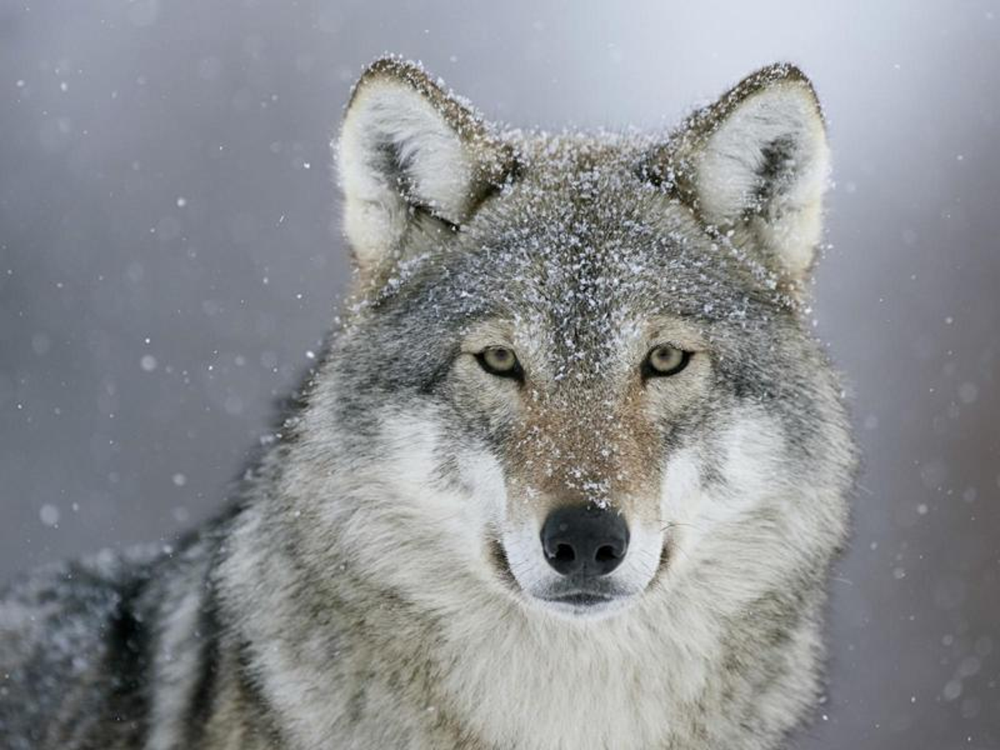

# Image Morphing

This is an image processing project. I utilize morphing this technique to transform one image to another one.

## Quick Start
```{shell}
pip install -r requirements.txt
python Morphing.py

# GUI
python MorphingApp.py
# Load two images, select some points on each one, and then click blending button!
```




